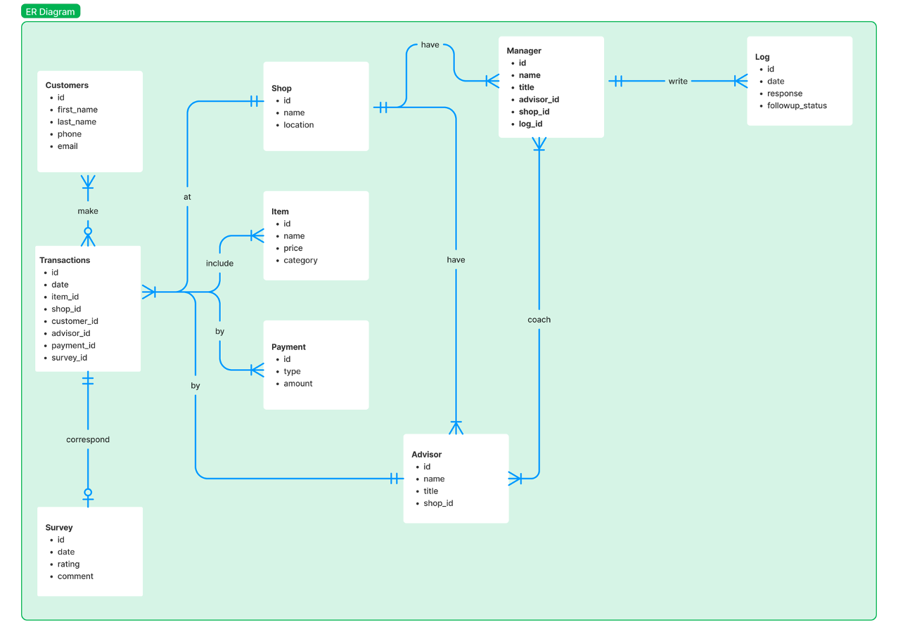

# Design Document

By Olivia Chan

Video overview: <https://youtu.be/XeVu74AGn4Y>

## Scope

The database for Survey SQL includes all entities necessary to facilitate the process of tracking manager's progress in following up client's response to our survey after making a purchase, and help managers to track the both the survey and corresponding transaction detail. As such, included in the database's scope is:

* Clients, including basic identifying information
* Transactions, including all transaction details
* Survey, including ratings, date and comments about the transactions
* Shop, which includes basic shop information
* Items, which includes items information
* Manager, including basic identifying information
* Advisor, including basic identifying information
* Log, which includes the managers feedback on the call and the follow-up status

Out of scope are elements like advisor's commission, item's discounts, and other non-core attributes.

## Functional Requirements

This database will support:

* CRUD operations for all activities
* Tracking all client's transactions and surveys

Note that in this iteration, the system will not support altering clients information.

## Representation
Entities are captured in SQLite tables with the following schema.

### Entities

The database includes the following entities:

#### Customers

The `customers` table includes:

* `id`, which specifies the unique ID for the customer as an `INTEGER`. This column thus has the `PRIMARY KEY` constraint applied.
* `first_name`, which specifies the client's first name as `TEXT`, given `TEXT` is appropriate for name fields.
* `last_name`, which specifies the client's last name. `TEXT` is used for the same reason as `first_name`.
* `phone`, which specifies the client's phone number as an `INTEGER`.
* `email`, which specifies the client's email as `TEXT`, given `TEXT` is appropriate for email fields.

All columns except `email` in the `customers` table are required and hence should have the `NOT NULL` constraint applied. No other constraints are necessary.

#### Transactions

The `transactions` table includes:

* `id`, which specifies the unique ID for the transaction as an `INTEGER`. This column thus has the `PRIMARY KEY` constraint applied.
* `date`, which specifies the transaction date as `DATE`.
* `item_id` This column thus has the `FOREIGN KEY` constraint applied, referencing the `id` column in the `item` table to ensure data integrity.
* `customer_id` This column thus has the `FOREIGN KEY` constraint applied, referencing the `id` column in the `customer` table to ensure data integrity.
* `advisor_id` This column thus has the `FOREIGN KEY` constraint applied, referencing the `id` column in the `advisor` table to ensure data integrity.
* `payment_id` This column thus has the `FOREIGN KEY` constraint applied, referencing the `id` column in the `payment` table to ensure data integrity.
* `survey_id` This column thus has the `FOREIGN KEY` constraint applied, referencing the `id` column in the `survey` table to ensure data integrity.

#### Survey

The `survey` table includes:

* `id`, which specifies the unique ID for the survey as an `INTEGER`. This column thus has the `PRIMARY KEY` constraint applied.
* `date`, which specifies the survey submission date as `DATE`.
* `rating`, which is an `INTEGER` specifying the rating given by the client. Rating should not be less than 0 and the maximum rating is 10.
* `comment`, which is the comment leave by the client as `TEXT`.

All columns except `comment` in the `survey` table are required, and hence should have the `NOT NULL` constraint applied. No other constraints are necessary.
The `rating` column has an additional constraint to check if its value is greater than 0 and less than or equal 10, given that this is the valid range for a rating score.

#### Shop

The `shop` table includes:

* `id`, which specifies the unique ID for the shop as an `INTEGER`. This column thus has the `PRIMARY KEY` constraint applied.
* `name`, which is the name of the shop as an `TEXT`.
* `location`, which is the name of the shop location as an `TEXT`.

All columns in the `shop` table are required, and hence should have the `NOT NULL` constraint applied. No other constraints are necessary.

#### Item

The `item` table includes:

* `id`, which specifies the unique ID for the item as an `INTEGER`. This column thus has the `PRIMARY KEY` constraint applied.
* `name`, which is the name of the item as an `TEXT`.
* `price`, which is the price of the item as `NUMERIC`.
* `category`, which is the item category as an `TEXT`.

All columns in the `item` table are required, and hence should have the `NOT NULL` constraint applied. No other constraints are necessary.

#### Payment

The `payment` table includes:

* `id`, which specifies the unique ID for the payment as an `INTEGER`. This column thus has the `PRIMARY KEY` constraint applied.
* `type`, which is the type of the payment like cash, visa, master,etc... as an `TEXT`.
* `amount`, which is the total amount swiped as `NUMERIC`.

All columns in the `payment` table are required, and hence should have the `NOT NULL` constraint applied. No other constraints are necessary.

#### Manager

The `manager` table includes:

* `id`, which specifies the unique ID for the manager as an `INTEGER`. This column thus has the `PRIMARY KEY` constraint applied.
* `name`, which is the name of the manager as an `TEXT`.
* `title`, which is the title of the manager as an `TEXT`.
* `advisor_id` This column thus has the `FOREIGN KEY` constraint applied, referencing the `id` column in the `advisor` table to ensure data integrity.
* `shop_id` This column thus has the `FOREIGN KEY` constraint applied, referencing the `id` column in the `shop` table to ensure data integrity.
* `log_id` This column thus has the `FOREIGN KEY` constraint applied, referencing the `id` column in the `log` table to ensure data integrity.

All columns in the `manager` table are required, and hence should have the `NOT NULL` constraint applied. No other constraints are necessary.

#### Advisor

The `advisor` table includes:

* `id`, which specifies the unique ID for the advisor as an `INTEGER`. This column thus has the `PRIMARY KEY` constraint applied.
* `name`, which is the name of the advisor as an `TEXT`.
* `title`, which is the title of the advisor as an `TEXT`.
* `shop_id` This column thus has the `FOREIGN KEY` constraint applied, referencing the `id` column in the `shop` table to ensure data integrity.

All columns in the `advisor` table are required, and hence should have the `NOT NULL` constraint applied. No other constraints are necessary.

#### Log

The `log` table includes:

* `id`, which specifies the unique ID for the log as an `INTEGER`. This column thus has the `PRIMARY KEY` constraint applied.
* `date`, which specifies the date the client is being contacted as `DATE`.
* `response`, which is the manager response to the conversation as `TEXT`.
* `followup_status`, which specifies the progress. If client is being contacted, marked yes so this column is specified as `TEXT`.

### Relationships

The below entity relationship diagram describes the relationships among the entities in the database.

As detailed by the diagram:

* One client is capable of making 0 to many transactions.
* A transaction is associated with 0 and only 1 survey.
* A transaction is associated with 1 and only 1 shop, whereas a shop can have 1 to many transactions.
* A transaction is associated with 1 to many items, payements respectively.
* A transaction is associated with 1 advisor at a time, while an advisor can make 1 to many transactions.
* A shop is associated with 1 advisor and 1 manager to many advisor and many managers, while one manager is associated with one shop at a time and one advisor is associated with one shop at a time.
* A survey is associated with 1 and only 1 transaction, while a transaction can have no survey associated with or 1 survey related to the transaction.
* A log is written by one and only one manager, while the manager can write 0 to many log.

## Optimizations

Per the typical queries in `queries.sql`, it is common for users of the database to access all logs follow up status by managers, as well as the advisor who corresponded to the transactions. Overall survey rating is of partiular concern as well. For that reason, indexes are created on the `followup_status`, `name`, and `rating` columns to speed up the searches by those columns.

## Limitations

The current schema assumes individual log submissions. In real-world case a client survey may follow up by several managers. Collaborative submissions would require a shift to a many-to-many relationship between managers and logs.

